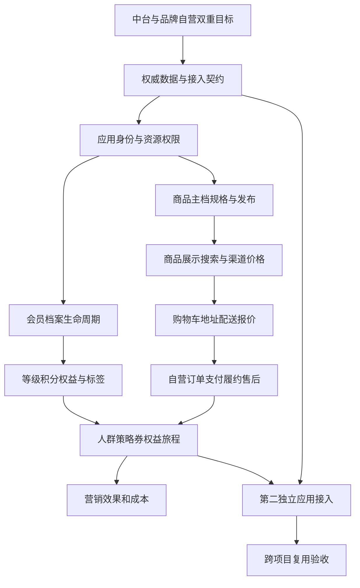

# 企业级能力演进路线（候选）

- 日期：2026-09-23
- 项目：`/Users/liruijun/personal/LLM/commerce-platform`
- 协议：`engineering-baseline/v1`、`skill-contract/v1`、`capability-exploration-report/v1`
- 分析基线：HEAD `fb7adf6278ed98c49d8851102031b061bcbb68bf` 加当前工作树。开始时已有 `CommerceController.java`、`CampaignService.java` 两处未提交修改，属于既有内容。
- 范围：源码、接口、Mapper、V1–V15迁移、前端、测试源码、CI配置与既有验收证据；只生成本目录分析产物。不执行产品修改、数据库写入、真实外部联调或生产操作。
- 结论边界：源码已有能力标 `FACT`；“未发现完整能力”及建设建议标 `INFERRED`；运行可用性、生产规模和本次测试结果标 `NEEDS_VERIFICATION`。未查询实时数据库、未重跑测试或远程CI。
- 已确认产品方向（用户，2026-09-23）：长期建设可供多个项目复用的会员、商品、营销能力中台，同时包含品牌自营商城＋会员运营。自营商城是实际业务应用，不仅是演示验证壳；第二接入项目及具体业务政策仍待设计。

## Exploration Summary

当前是**具备本地交易闭环、部分营销治理和一致性机制的业务基础版本**，尚不能按“完整企业级经营平台”评价。此前S0–S10完成表示批准切片已交付，不表示所有企业业务能力都已覆盖。会员和商品主要处在BASIC，营销处在PARTIAL；工程机制的完整程度高于业务功能广度。

产品定位是“共享能力中台＋品牌自营商城应用”。会员、商品、营销负责可复用业务能力；自营商城承载消费者购物、订单、支付、配送、售后及品牌运营。建设同时补齐共享主数据与实际购物闭环，再深化会员营销，最终由第二独立应用验证复用。独立商家入驻、佣金结算和完整仓内作业仍按需建设。

## Evolution Principles

1. 产品目标包含两部分：可复用的会员/商品/营销中台，以及实际经营的品牌自营商城。不能只建设通用接口，也不能只完善商城页面。
2. 共享能力与自营应用分别验收。商城调用共享能力；第二项目可以使用自己的订单/前端，不要求更换成整套商城。
3. 先明确权威数据和协作边界。租户、调用应用、品牌/组织、商家、门店分别定义，不直接合并为一个tenantId；自营多店不自动等于多商家平台。
4. 会员共享需要归属与授权，不能只凭手机号合并；商品主档与渠道价格、可售范围和库存来源分别明确责任。
5. 保留已有幂等、快照、金额分摊、状态机、Outbox/Inbox和补偿；接入外部事实时明确重复、乱序、未知结果和恢复。
6. 现有模块化单体可作为演进基础；不因“中台”预设微服务拆分或替换规则引擎。本文只做WHAT TO BUILD，不修改正式架构/契约。
7. 外部IdP/支付/权益/WMS联调沿用后置安排；内部能力与契约可以先建设。真实经营前必须取得对应接入、对账和运行验收证据。

## Capability Dependencies

该图表达能力依赖，不表示每阶段完全串行。基础营销、核心交易与数据治理可在契约明确后分支推进；积分政策未定时不阻塞商品和购物闭环。

## Phase 1：业务蓝图与能力边界

**范围**：S01、P03前移；M01/C01的数据归属与映射，以及S02/S03的必要治理约束。

**业务结果**：

- 明确哪些会员、商品、价格、库存、订单、支付、积分、券/权益由本平台负责，哪些来自外部系统。
- 明确自营品牌/店铺范围、消费者与运营角色；区分人和调用应用，定义外部主体与资源编号作用域。
- 选择首批自营经营场景与一条未来复用链，定义请求/事件、权限、幂等、兼容和异常结果的业务语义。
- 形成三层能力地图：共享中台、自营业务应用、外部适配与治理；不为此立即拆服务。

**验收方向**：边界可审查、权威无冲突；主体映射不误合并；自营业务范围与跨项目共享授权清楚。正式蓝图、架构、契约由后续对应技能负责。

## Phase 2：商品与会员可以持续运营

**共享会员**：M01档案维护、状态、主体映射；M02等级/成长与M04标签逐步推进。M03积分纳入长期能力图，获取、兑换、到期、退款政策确认后实施。

**共享商品**：C01类目/品牌/属性/规格/媒体；C02编辑、审核、发布、上下架和价格版本；C03查询筛选、有界批量维护。明确主档、渠道售卖资料与价格责任。

**自营应用同步完善**：消费者商品列表/详情/搜索/规格选择；会员档案与券/权益展示。消费已有API与数据库，不另建页面硬编码数据或复制中台业务规则。

**验收方向**：运营能完成真实品类从草稿到售卖再到调价/下架；会员资料和状态可管理；历史成交快照不变；调用方资源范围由服务端强制。

## Phase 3：补齐品牌自营购物与交易体验

**范围**：T01持久购物车、地址簿、配送范围与运费计价；在现有订单、库存预占、支付、履约和部分退货退款基础上补业务体验；T02物流/售后操作入口；按合同准备T05支付退款/对账适配。

**建议分成完整业务成果**：

1. 跨会话购物车、规格选择与失效商品处理。
2. 地址与可配送范围、运费报价及成交快照。
3. 订单查询/取消、支付结果未知的可见处理、履约跟踪、售后申请/证据/处理状态。
4. 支付退款与渠道账单差异、物流回执及异常处理；真实外部联调仍按用户后置安排启动。

**验收方向**：消费者能完成浏览→购物车→报价→下单→支付→配送→售后；优惠、运费与退款金额可核对。内部沙箱只验证平台流程，不能据此宣称真实收款或发货。

多包裹、换货、税费/发票等按商品与经营地区的实际政策选择；不一次扩展所有场景。

## Phase 4：深化会员营销运营

**范围**：M02/M04、K01动态人群、K02优惠范围/组合、K03券运营、K04生命周期旅程、K06效果与成本；P02规则模拟、K07防滥用、S02审批贯穿。

**建议首条闭环**：可信订单/退款形成会员行为→刷新人群→运营发布指定商品活动/券→自营消费者得到可解释优惠→核销与退款补偿→指标及成本可核对。

**复用要求**：交易事实既可以来自自营商城，也可由获授权的外部交易系统提供；不能把所有营销流程锁定为只读本地订单表。重复/乱序/迟到与历史回补需有明确语义。

**触达分支**：K05先选一种真实渠道，具备偏好/退订、频控、模板、回执与未知结果查询；实际对外发送由具体接入任务授权。

## Phase 5：第二项目复用验收

**范围**：P03稳定接入合同、S01应用/资源权限、主体/商品/单据映射，以及被选中的共享业务能力。

**验收方向**：

- 第二独立应用无需复制核心业务代码或直连中台业务表。
- 同一经授权共享的会员/券/商品目录能被使用，未共享数据保持隔离；同外部编号不误合并。
- 跨应用同时核销不重复扣减，重复/乱序支付退款事实不重复奖励。
- 失败、重放、对账有可见结果；明确兼容窗口内新旧消费者可共存。
- 测试客户端只能证明契约验证；真实第二业务应用验收后，才称“跨项目复用已验证”。

根据实际共性再增强P01批量运营任务、P02规则治理；不预建无实际消费者的万能框架。

## Phase 6：按运行目标完成企业治理

O01监测支付未知、订单异常、退款延迟、权益补偿、旅程积压及调用方失败；S03落实数据保留、敏感访问、密钥和隔离恢复；按租户/应用验证配额与资源公平性。

权限、审计和数据治理从Phase 1开始，并非最后才加入。真实开放前完成相应条件门槛；SLO、容量与RTO/RPO按业务目标和实测记录，不虚构承诺。

## 条件建设范围

| 候选 | 当前安排 | 触发条件 |
|---|---|---|
| T03完整多仓/仓内作业 | 不作为三大中台默认职责；保留现有可售库存和预占 | 明确由本平台负责仓内业务，或真实WMS需要协作 |
| T04独立商家入驻/佣金/结算 | 后置 | 从品牌自营扩展为实际管理独立商家 |
| 复杂促销、付费会员、订阅、邀请裂变 | 独立选择具体场景 | 有运营政策、成本上限和可验证目标 |
| A/B及增量效果 | 数据成熟后 | 样本、对照、转化窗口和退款口径明确 |
| Drools及旧规则迁移 | 独立评估 | AST表达受阻或旧规则兼容需求获确认 |
| 微服务、搜索、缓存、消息平台、数仓、AI | 证据驱动 | 实际规模、查询或收益触发 |

## 下游交接

已确认的方向是“会员、商品、营销中台＋品牌自营商城”。下一步建议形成业务蓝图、数据所有权和接入契约，再按完整纵向业务切片实施。

尚需在蓝图中确定：自营品牌/店铺与商品类型、收款和配送/售后政策、会员等级积分政策、第二接入项目、跨项目共享授权及运行目标。当前更新仅限五份探索文档，未改变原S0–S10正式设计与产品代码。
