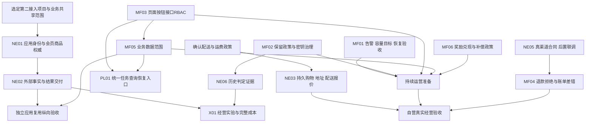

# 能力演进路线：在已完成阶段 8 上继续建设

- generated_at：2026-09-27；baseline：`7dda31ed017617f3701480f8a2d1620656c843cc`
- permission_followup：`afc5e940c1dd988759880ad9f03106e68170ad0e`；权限建设单列，不再只写运营分工。
- protocol：`engineering-baseline/v1`、`skill-contract/v1`、`capability-exploration-report/v1`
- 来源：Claude `project-capability-exploration`；本路线为候选，不是新批准的交付计划。

## Exploration Summary

已有会员/商品/营销基础及可靠运行机制应继续复用。最值得启动的是中台接入边界发现、自营持久购物和运营/长期运行治理。不是把9月23日路线从头执行，也不是直接开启通用工作流阶段。

## Evolution Principles

1. 现有会员周期、积分、商品经营、规则、人群和Journey作为已具备能力；不再列入待补基础任务。
2. 共享中台与自营商城分别验收：第二项目能够保留自己的订单/前端，才证明业务复用。
3. 先选真实接入应用、权威数据和共享政策；tenant、application、channel、store不机械合并。
4. 不因“中台”先拆服务，不因“可扩展”重建规则/权益/调度机制。
5. 优先完成具体业务结果与操作治理；每项容量/SLO/保留政策必须有依据。
6. 仍以关系库权威、事务/状态机/幂等/Outbox/Inbox保护现有不变量；外部保障范围单独验收。
7. 外部IdP/支付/权益/WMS联调维持已约定后置；可先明确业务合同和内部状态边界。
8. 本轮探索只生成自有报告；正式BRIEF/架构/契约/选型与实现由被选定的后续任务负责。
9. 动作权限与数据范围分别定义并组合执行；页面隐藏不替代接口授权，租户隔离不替代同租户岗位范围；不要求把会员等数据机械归属到门店。

## Capability Dependencies

图为业务依赖，不意味着全部串行。告警/数据治理与自营购物可以在各自政策明确后独立推进。NE01不依赖先完成购物或先迁移微服务。

## Phase 1：选择并收口最直接的建设目标

- 候选：NE01、NE03；MF01–MF03/MF05/MF06按长期运行、多人分权或奖励承诺触发。
- 中台分支：选择一个确实需要会员/商品/营销复用的独立应用；明确应用、外部主体/商品标识、权威和共享范围。
- 自营分支：确认跨会话购物、地址、可配送范围和运费/退款政策；复用已有商品/报价/订单。
- 权限分支：MF03确认账号/角色/页面/动作矩阵，MF05逐资源确认数据归属和组织/门店/负责人/本人等范围；以一个“动作＋范围”业务链验证页面与接口。不依赖先接真实IdP。
- 治理分支：明确自批政策、赠券/礼包承诺、保留依据和值班目标。
- 候选验收：权限矩阵和数据范围有业务负责人可评审；没有同一数据两个写入权威；没有将未知政策写成默认承诺。

若即将开放多岗位或门店分权，优先选MF03/MF05的一个完整权限纵向链路；单管理员自营购物目标可先选“持久购物车＋地址簿”；核心目标是中台复用则先选“第二接入项目边界与契约发现”。优先级由实际使用目标决定，不能虚构第二项目或默认所有权限策略。

## Phase 2：兑现一个业务闭环

- 自营主线：NE03，浏览/加购→刷新或跨会话继续→地址/配送报价→下单快照→取消/售后核对。必要的物流/售后资料随真实需求加入。
- 中台主线：NE01→NE02，第二应用已有身份/商品/订单→授权映射/可信事实→共享积分或营销结果→可靠交付/核对。
- 候选验收：身份/资源不串用，重复和乱序可恢复；购物数据写数据库，前端从接口读；新旧成交快照可共存。
- 若开放受限岗位，同步验收MF03/MF05：无动作权限者直接调用接口被拒绝；有动作但无资源范围者不能通过列表、详情、写操作或统计获取/改变范围外数据；任务和未来导出继承相同规则。
- 不把“另开一个页面”“换一个tenant灌种子”“给伙伴一个ADMIN token”算作中台复用验收。

## Phase 3：持续运营和治理准备

- MF01：接真实持续采集/告警送达；按实际业务负载建立等待目标、混合持续负载和隔离恢复证据。
- MF02：数据分类/保留、Journey步骤与行为生命周期、密钥版本与恢复传播；是否执行清理取决于已批准政策。
- MF03：可配置账号/角色/菜单/按钮/接口动作授权、职责分离、撤权和审计；多人分权触发时应提前在Phase 1–2完成。
- MF05：逐资源定义业务数据范围，统一列表/详情/汇总/写操作/任务的服务端约束；定义动态归属和撤权对在途工作的处理。
- MF06：明确赠券退款和礼包部分成功后的可见处置。
- NE07：按发布要求补后端供应链证据及能拦截真实回归的边界检查。
- 候选验收：告警能送达/清除/升级；恢复环境业务数据与密钥可用；清理不破坏幂等/重放窗口；撤权与越范围请求被服务端拒绝。
- 当前历史kill/restart、局部压测、现有CI无需因报告更新重跑；正式运行认证必须绑定新的目标负载和环境。

## Phase 4：运营效率与解释能力

- NE04：从真实文件/合作方输入中选择一个导入/维护场景，做完整的输入校验、预览、逐项结果与恢复；媒体能力按上新实际需要触发。
- PL01：统一查询与恢复体验，保留原领域控制和业务状态；不创建第二个任务执行权威。
- NE06：按决策申诉或发布风险，补必要的事实版本/有限判定证据和样本差异比较。
- 候选验收：停止/部分成功/重试可解释；输入版本变化不覆盖已有运营修改；历史样本不是用当前事实冒充过去。

## Phase 5：按原安排接入真实渠道

- NE05/MF04：真实IdP、支付/退款、权益、WMS；其中确定拒绝、原请求号重查、资金上限、账单差错、地址授权披露要形成闭环。
- 依赖：已确认的供应商合同/沙箱权限、MF01–MF03/MF05/MF06相关政策和环境。缺权限时只记录阻塞，不扩大到共享/生产环境。
- 候选验收：权威金额币种/主体校验，重复/乱序/超时后的未知处理，确定拒绝与重发政策，真实账单差错处置和恢复。
- 真渠道验收、生产容量和实际部署是不同目标；本路线不授权生产部署。

## Future Exploration

X01经营实验与全成本：有优化目标、成本数据和可接受实验样本才启动。X02多仓、商家结算或特定玩法：对应经营业务正式进入范围才启动。

当前不建议AI、通用BPM、全量拆服务或新中间件。若将来出现表达/吞吐/独立隔离压力，先收集证据再做边界/技术选型评估；不在本探索中敲定方案。

## Priority / Dependency Overview

| 候选 | 优先级 | 最先缺的输入 | 启动性质 |
|---|---|---|---|
| NE01/NE02 多项目复用 | P1 | 首个独立接入项目、权威/共享授权 | 目标已成立，具体用例待定 |
| NE03 持久购物 | P1 | 配送/地址/运费及退款政策 | 自营实际应用的自然演进 |
| MF01 长期运行保障 | P1 | 真实峰值、等待/恢复目标、值班 | 持续/生产运行前门槛 |
| MF02 生命周期/密钥 | P1 | 保留依据、删除/轮换政策 | 长期/敏感治理门槛 |
| MF03 页面/按钮/接口RBAC | P1 | 账号/角色/动作矩阵、职责规则 | 多岗位/分级运营/高成本动作开放前 |
| MF05 通用数据范围 | P1 | 资源归属、授权范围、撤权政策 | 同租户部门/门店/岗位隔离前 |
| MF06 奖励政策 | 条件P1 | 激励承诺与部分失败处置 | 相应奖励承诺上线前 |
| MF04/NE05 外部与财务 | 条件P1 | 供应商合同/权限 | 保持后置 |
| NE04/NE06/NE07/PL01 | P2 | 真实输入/申诉/门禁/运营使用 | 有具体痛点再落地 |
| X01/X02 | P3 | 明确经营目标 | 探索，不先实施 |

## Handoff

选择具体候选后提供本目录[能力地图](CAPABILITY_MAP.md)、[缺口](CAPABILITY_GAPS.md)、[机会](OPPORTUNITIES.md)及[证据](EVIDENCE_INDEX.md)，交给Claude中的 `enterprise-feature-development` / `backend-architecture-design` / `public-engineering-workflow`。这不要求用户现在做所有取舍，也不自动开始设计或实现。

探索完成的gate只验证分析产物。当前recommended_next=stop：交付报告；业务建设需另选目标。
