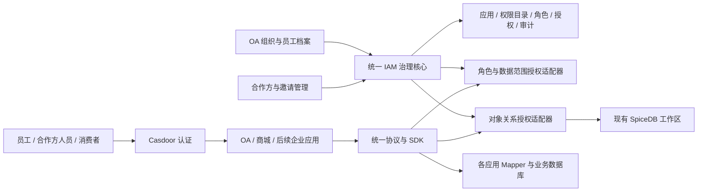

# 企业统一身份、权限与项目接入整体方案

- 任务：IAM-PLAN-20260927；版本：v1；状态：**方案待业务确认，建设与接入尚未实施**。
- 适用范围：`auth-platform`、`oa-platform`、`commerce-platform`，以及后续企业应用。
- 本轮交付：完整接入与执行计划；不修改业务代码、数据库、认证配置、已有授权或部署。
- 事实、拟议决策、验收和当前状态分别见 [证据](EVIDENCE_INDEX.md)、[架构](BACKEND_ARCHITECTURE.md)、[迁移验收](MIGRATION_AND_VALIDATION.md)、[进度](PROGRESS_STATE.md)。

## 1. 建设目标与平台形态

将 OA 现有 IAM 治理、组织与审批能力，和 auth-platform 的对象授权协议、SpiceDB 适配器、SDK 整合为统一企业身份与权限平台。平台统一管理“谁能进入哪个应用、能执行什么动作、能操作哪些数据、何时到期、谁批准”，各业务系统执行校验并保有业务数据。

建议先统一产品入口、用户目录、应用目录、授权管理和接入协议，保留现有部署与数据库。IAM 核心作为清晰模块演进；OA 考勤、公文等是消费方，商城订单、会员等也是消费方。同一仓库或单个部署进程属于后续物理整合选项，不作为第一轮项目接入的前置条件。



图中 IAM 是目标逻辑边界，不代表新增一个部署服务。Casdoor 继续负责认证；角色审批与授权不因登录成功自动成立。统一平台为各应用提供同一套规则和管理能力，应用仍需声明自己的权限点、资源归属和查询映射。

## 2. 先分清企业、应用、组织与业务资源

| 概念 | 定义 | 示例与约束 |
|---|---|---|
| 企业租户 `tenantId` | 最外层身份、授权、数据隔离边界 | 一家企业拥有多个平台；一期以企业内部使用为主，后续多企业扩展仍保持隔离 |
| 企业成员关系 `membershipId` | 人或机器与某企业的关系及状态 | 员工、受邀合作方人员；属于企业目录不等于有应用访问权 |
| 应用 `appId` | 独立业务能力与权限命名空间 | `oa`、`commerce`；一个应用可有 Web、移动端、后台任务等多个客户端 |
| 登录客户端 `clientId` | 某应用在某环境的登录或机器认证配置 | 开发、测试、生产分开；客户端不等于企业，也不等于业务角色 |
| 组织单位 `orgUnitId` | 部门、事业部等组织关系 | 人事目录提供；在部门任职不自动成为该部门业务数据管理员 |
| 合作方组织 `partnerOrgId` | 企业认可的供应商、经销商、外包方等 | 独立于员工组织树，人员、合同及准入状态有明确负责人 |
| 业务资源 | 各应用拥有的门店、商家、项目、订单、文件等 | 商城维护门店和订单归属；平台不能自行把部门推断成门店 |
| 运行环境 `environment` | 权限配置、凭据、工作区的运行隔离 | 测试授权不得被生产接受；授权上下文与客户端配置绑定 |

**同一个企业接入多个平台，不为每个平台重新建一套企业用户。** 当前 auth 的项目工作区与 Casdoor organization 映射继续兼容，通过显式映射接入目标模型；不立即重命名现有组织、用户或关系对象。

集团内子公司如果需要硬隔离，应选择独立企业租户；如果允许在集团内共享人员与授权，应作为公司／资源范围管理。这个业务选择见 Q01，不能靠“部门层级”代替确认。

## 3. 用户目录与身份模型

同一人可以兼具员工、客户或合作关系。这些是有作用域的成员关系，不能用一个全局 `userType` 互斥地替代全部身份。

| 用户／主体类别 | 资料来源与权威 | 初始准入 | 权限来源 | 退出处理 |
|---|---|---|---|---|
| 正式员工 | OA 员工／组织，未来可接 HR；Casdoor 提供认证绑定 | 员工有效，可获得经确认的 OA 基础访问 | 已批准的岗位角色规则、显式应用授权、临时申请 | 离职／停用成员关系后阻断该企业员工访问，撤销相关应用授权和会话能力 |
| 受 HR 管理的合同员工 | HR／OA 合同员工档案 | 与合同和任职期限绑定 | 按岗位及应用范围授予，不能仅凭“合同员工”标签自动扩大权限 | 合同到期或离职触发员工成员关系退出 |
| 外部合作方人员 | 合作方登记、企业邀请、企业担保人与合同关联 | 接受邀请并完成身份验证，企业与应用准入有效 | 限定应用、角色、合作方／项目／门店范围、有效期 | 担保人变更、合同结束、合作方暂停、人员离开或到期均可收权 |
| 普通消费者 | 认证绑定由身份目录维护；会员与购买资料由商城维护 | 注册／登录及商城会员绑定有效 | 商城消费者基础策略＋本人数据，不逐人手工授予运营角色 | 账号封禁、会员冻结／关闭分别按身份与会员业务规则处理 |
| 服务账号、API 客户端、机器人、Agent | 平台登记＋服务／人员负责人 | 主体和凭据均有效，调用应用明确 | 自身应用动作与资源范围；不得继承负责人的全部权限 | 负责人离职进入重新托管／暂停流程；轮换、停用、到期、凭据吊销 |

基础模型见 [架构第 3 节](BACKEND_ARCHITECTURE.md)：人类身份与员工档案解耦，保留现有 `USER` 与 Casdoor subject 兼容；外部人员通过新邀请入口创建成员关系，不伪造员工记录。

外部认证绑定使用经验证的 `(issuer, subject)`。同邮箱、手机号或姓名不足以自动合并账号；若同一人在不同应用得到不同 subject，需要受控绑定映射。OIDC 的稳定身份键由 `iss` 与 `sub` 共同确定。[OIDC 身份标识规则](https://openid.net/specs/openid-connect-core-1_0.html#ClaimStability)

## 4. 企业内部多个应用怎样划分角色

### 4.1 平台治理角色

以下是目标职责，不等于当前系统已经全部具备这些角色。

| 治理角色 | 允许管理 | 默认不附带的业务能力 |
|---|---|---|
| 平台运营管理员 | 平台运行、应用登记、认证配置和故障处理 | 企业业务数据读取、财务处理、任意角色授予 |
| 企业身份管理员 | 本企业成员、合作方、身份准入和生命周期 | 其他企业目录、业务应用敏感数据 |
| 应用负责人 | 本应用的权限目录、角色定义、接入及版本发布 | 其他应用的角色修改、任意扩大自己的可授予权限 |
| 企业授权管理员 | 在批准的可授予角色与范围内分配／撤销授权 | 自己批准自己的高风险授权、修改权限语义后扩大既有授权 |
| 组织／合作方授权管理员 | 指定组织或合作方人员的已批准授权包 | 超出本应用、合作方或资源范围的授权与转授 |
| 审批人 | 经工作流和职责规则指派的授权审批 | 因能审批就获得被审批的业务权限 |
| 审计员 | 指定企业和应用的授权来源、变更、决策与到期记录 | 修改授权、查看无关企业身份信息或业务明文 |
| 紧急访问人员 | 有限时、理由、复核的应急访问 | 永久全局超级权限；应急流程须单独定义 |

管理员的“管理范围”和被授予人的“业务数据范围”分别计算。可授予上限由企业策略给出，不能因为管理角色拥有角色编辑权，就自行新增敏感动作并授给自己。

### 4.2 应用业务角色

角色按应用命名。例如 `oa:department-approver`、`commerce:store-operator`。角色定义岗位能做的动作，具体门店、部门、合作方和时间窗放进每次授权记录，不为每家门店复制一份角色。

| 应用 | 建议业务角色 | 动作示例 | 数据范围示例 |
|---|---|---|---|
| OA | 普通员工 | 本人考勤、本人申请、获准文档查看 | 本人＋单独共享的文档 |
| OA | 部门审批人 | 办理授权给自己的审批任务 | 明确部门范围及合法待办关系 |
| OA | 人事专员 | 经批准的人员资料维护 | 指定组织；敏感字段另有权限 |
| 商城 | 商品运营 | 商品查询、编辑、上下架 | 门店集合或商家范围 |
| 商城 | 订单客服 | 订单查询、允许的售后操作 | 指定门店；地址／联系方式按权限脱敏 |
| 商城 | 营销编辑／审核／发布 | 对应独立动作 | 指定门店或经批准的企业范围；冲突岗位需职责分离 |
| 商城 | 财务审核人员 | 经批准的退款审核等 | 指定业务范围；金额和审批约束独立校验 |
| 商城 | 合作方运营 | 合作合同允许的商品或订单动作 | 本合作方被映射到的商家／门店／项目；对象与字段再收窄 |
| 后续项目 | 项目成员／项目管理员／查看人员 | 在该应用发布的权限目录内定义 | 项目集合、负责对象、本人等 |

这是初始角色建议。退款审核、供应商订单关系等不能仅因角色示例就当成商城已有功能；相关业务模型未具备时保持不开放。

### 4.3 授权记录与叠加规则

每次授权至少包含：

```text
企业 + 环境 + 应用 + 主体/成员关系 + 角色版本
+ 动作对应的数据范围 + 条件 + 有效期 + 来源/批准人 + 版本
```

“用户有多个角色”允许；“把所有角色的动作与所有范围分别合并”不允许。每个授权条款必须保留动作和范围的关联，再对同一动作合并有效范围。

例如：张三在门店 A 有订单查看权，在门店 B 有商品编辑权；结果只能是“查看 A 的订单、编辑 B 的商品”，不能编辑 A 的商品，也不能查看 B 的订单。企业禁用、人员停用、成员关系失效、外部到期、应用未准入等拒绝约束优先。

按部门或岗位自动分配时，只使用已审核的“组织／岗位 → 应用角色”规则。调岗先撤除规则产生的旧授权，再生成新授权；个人审批授权保留来源并按新任职关系复核。组织管理员、应用管理员与业务审批岗位不互相自动继承。

## 5. 外部人员管理的完整流程

### 5.1 合作方人员

1. 企业身份管理员登记合作方组织、有效状态、合同关联、企业担保人和允许接入的应用。
2. 担保人或合作方管理员在自己的管理上限内发出单次邀请：人员、应用、候选角色、资源范围、有效期及用途明确。
3. 邀请发送复用已有通知能力；邀请令牌只存哈希，限制有效期、重复使用及尝试次数。通知发送与创建邀请分开记录，失败能恢复。
4. 外部人员完成认证、联系方式验证并接受邀请；平台建立外部成员关系，不创建 OA 员工档案。
5. 应用负责人／资源负责人按风险审批；申请人与批准人分离，高风险或敏感数据访问附加验证。
6. 授权生效后，仅显示已准入应用；后端持续检查合作方、成员关系、时间窗、动作和资源范围。
7. 担保人定期复核；到期续期是新的授权决策，不自动延长原授权。到期、人员离开或合同终止触发收权。

外部角色默认不能授予其他人员、访问内部组织目录、进入 OA 员工功能或跨合作方读取数据。需要这些能力时必须形成单独业务授权及可授予上限。

### 5.2 消费者

商城保留会员、积分、等级、订单等业务资料的所有权。身份平台维护最小认证关联，不把消费者当作企业员工，也不要求管理员为每个消费者逐项配角色。

消费者基础能力由商城注册的固定策略授予，只允许本人会员、本人订单、本人权益等。员工同时作为消费者时，要选择“企业工作”或“消费者”上下文，分别使用对应客户端／会话和授权；不得把后台运营权限带到普通购物请求中。

消费者身份封禁与会员冻结是不同操作。身份封禁阻断该认证身份；会员冻结影响购买和权益规则。员工离职撤销员工成员关系，不默认关闭其个人消费者账户，具体关联政策见 Q02。

### 5.3 生命周期与恢复

| 对象 | 主状态 | 关键规则 |
|---|---|---|
| 全局身份 | ACTIVE、SUSPENDED、DISABLED | 封禁、恢复与凭据吊销分别审计；恢复不自动恢复已撤销的授权 |
| 企业成员关系 | INVITED、ACTIVE、SUSPENDED、EXPIRED、ENDED | 员工和合作方按来源分别维护；一个关系结束不自动删除其他关系 |
| 应用准入 | PENDING、ACTIVE、SUSPENDED、REVOKED | 准入只允许进入，不等于拥有全部动作 |
| 角色授权 | REQUESTED、APPROVED、ACTIVE、EXPIRED、REVOKED | 时间窗参与每次判断；回收任务用于状态维护，不是到期生效的唯一机制 |
| 外部邀请 | CREATED、ACCEPTED、EXPIRED、CANCELLED | 单次接受、身份与企业绑定；不能通过重放创建第二个成员或授权 |

状态是目标语义，现有表枚举继续兼容，最终字段契约在执行切片前确定。跨应用离职／收权提供可查询的执行进度，未完成分发不能显示“所有平台已撤权”。

## 6. 数据权限如何接入

统一平台管理数据范围的语义，业务系统负责映射到自己的表与字段。首期支持必要类型：`NONE`、`SELF`、`ORG`、`ORG_SUBTREE`、`RESOURCE_SET`、`BUSINESS_ORG`、`OBJECT_RELATION`、`ALL_IN_TENANT`。每种类型要按应用、资源类型和动作登记；未登记或不支持时拒绝，不能退化成全量查询。

| 业务场景 | 平台描述 | 应用执行 |
|---|---|---|
| OA 部门资料 | 指定组织或子树范围 | OA 沿用受管 `org_path` 查询适配器 |
| 商城门店运营 | 指定门店集合或商家范围 | MySQL Mapper 中绑定参数、关联受控范围投影，在分页前过滤 |
| 消费者订单 | 当前消费者会员绑定 | 服务端解析 `memberId`，查询同时限制企业和本人 |
| 合作方业务 | 当前合作方及明确映射资源 | 业务系统核实资源归属与关联关系；缺少关联模型时不开放 |
| 知识库共享文档 | 对象与主体的访问关系 | auth 适配器调用对应工作区 SpiceDB，保留资源前缀与一致性水位 |

列表、总数、详情、修改、删除、导出、统计、异步任务、附件与下载均使用同一动作／范围语义。字段脱敏与明文查看是独立权限，不能只限制行而把敏感字段全部返回。

业务系统不能先分页再删除无权限数据，也不能把请求传入的 `tenantId`、`storeId`、`memberId` 直接当成可信授权范围。写操作还要在事务内验证真实资源归属、合法状态和版本。完整规则见 [接入契约](CONTRACT_REQUIREMENTS.md) 和 [验收矩阵](MIGRATION_AND_VALIDATION.md)。

## 7. 每个新项目的标准接入流程

1. **登记应用**：确定 appId、负责人、环境、登录客户端、精确回调地址、服务身份、审计范围与退出负责人。
2. **登记权限目录**：按“资源＋动作”定义稳定权限点，声明对应 API、页面、按钮、风险、字段权限与权限版本。测试、生产分别发布。
3. **定义角色与范围**：提交岗位角色矩阵、角色可授予上限、资源归属、角色冲突、范围适配器和失效规则。
4. **接入认证与身份映射**：OIDC 登录，验证可信 issuer、签名、有效期和适用受众；保留老身份映射，未绑定身份不给后台角色。
5. **接入服务端授权**：使用统一 SDK 的身份上下文、动作检查、数据范围与对象检查；新增接口默认拒绝，形成接口覆盖清单。
6. **接入前端**：读取当前应用的有效权限与菜单，保护路由和按钮；资源级操作再取对象决策，后端仍独立判断。
7. **接入生命周期**：员工调岗／离职、外部暂停／到期、角色变更、应用停用、撤权版本、任务重检与失败恢复。
8. **准备可重复数据与负向用例**：数据来自隔离测试数据库，至少两个应用、两个数据范围、两类用户；不把演示数据写死在页面。
9. **影子比较与试点**：旧路径继续执行，目标路径只比对；解释全部安全差异，按应用与人员队列灰度。
10. **准入与运行交接**：完成安全、兼容、故障及回退验收，登记应用的当前协议版本和撤权能力；再扩大接入。

新应用在 Casdoor 中注册独立应用／客户端；多个应用可复用已有组织中的登录身份。实际业务准入仍由 IAM 控制。[Casdoor 应用模型](https://casdoor.ai/docs/application/overview/)

## 8. 执行顺序与首个试点

| 阶段 | 主要结果 | 涉及仓库 | 退出条件 |
|---|---|---|---|
| P0 业务与基线确认 | 用户分类、隔离边界、角色矩阵、资源所有权、现有身份映射、撤权目标 | 三仓只读＋设计 | Q01–Q07 有负责人，试点所需决策已确认 |
| P1 身份与应用目录 | 应用登记、成员关系、员工投影适配、外部邀请、准入 | OA 为治理主体，auth 增量适配 | 员工与外部人员可进入获准应用，不能横向进入其他应用 |
| P2 统一授权与接入协议 | 应用角色、动作与范围关联、统一 API／SDK、版本与审计 | OA、auth | 一个授权的范围不与另一个授权的动作串联；服务身份不能冒充任意人 |
| P3 商城内部人员试点 | 一条完整商品操作链路，随后订单只读链路与字段权限 | commerce | 菜单、接口、查询、详情、写入、到期、撤权与兼容均验收 |
| P4 商城外部人员与消费者 | 外部合作方限域运营、消费者认证／会员绑定 | 三仓 | 外部跨合作方拒绝；本人数据约束保持；退出可追踪 |
| P5 OA＋商城跨应用验证 | OA 消费统一协议，第二应用接入模板验证 | OA、commerce、auth | 同一个人的 OA 与商城权限独立；一套账号生命周期覆盖两应用 |
| P6 推广与平台整合 | 接入模板、运维看板、复核、更多应用、可选物理整合 | 按实际项目 | 每应用通过接入门禁；仓库／进程合并另有完整迁移证据 |

首个试点使用真实存在的商品经营链路：内部商品运营获得门店 A 的商品读取／修改权限，门店 B 修改被拒绝。第二条链路是订单客服按门店查看订单、按字段权限查看地址。已有退款或营销敏感操作在独立审核后扩展。

详细任务依赖、负责人职责、输入、输出、验收、失败处理与回退见 [执行计划](EXECUTION_PLAN.md)；可审查的依赖图见 [执行 DAG](EXECUTION_DAG.json)。本计划不指定未经确认的工期、人员数量、生产 SLO 或上线日期。

## 9. 能验收才算接入完成

每个应用至少证明：未授权应用进不去；错误企业／环境／受众的凭据被拒绝；同企业不同门店／部门之间隔离；管理员可授予上限有效；外部到期与员工离职生效；权限源不可用时行为明确；撤权不会被旧缓存或回退恢复；列表／详情／写操作／下载／任务一致。

授权变更有“已登记、正在分发、已验证生效”等可观察状态。高风险动作需要权威版本或一致性证明，不能仅靠旧 JWT 角色或缓存。各类型撤权时限与可接受陈旧窗口在 Q06 确认，当前尚无生产达标声明。

当前技术证据只支持进入平台能力整合与边界准备。Claude 架构演进规划器的本轮结果是 `REMEDIATION_PLAN`、`CUTOVER_BLOCKED`：先补基线、边界、契约、数据所有权和事务证明，未给出直接物理迁移许可。这不影响完整建设计划的形成，也不代表计划中的能力已经上线。

## 10. 实施前需确认的业务决策

| ID | 决策 | 本方案建议／暂定假设 | 影响与确认时点 |
|---|---|---|---|
| Q01 | 企业／集团隔离边界 | 一个企业多个应用；集团子公司按硬隔离需求选择租户或公司范围 | P0；决定身份、授权与数据主键作用域 |
| Q02 | 同人多个关系与退出 | 员工离职仅结束员工关系；消费者与合作关系单独判断 | P0；影响全局停用和账号关联 |
| Q03 | 外部类别、担保人与期限 | 合作方人员需担保、明确期限、限定应用与资源；消费者走自助基础策略 | P0/P1；最大邀请／授权期限及复核周期待企业政策确定 |
| Q04 | 角色动作与敏感操作 | 角色按岗位，审核／发布／退款与授权管理分开 | P0；角色矩阵与四眼审批规则由业务负责人确认 |
| Q05 | 资源归属及范围继承 | 门店／部门／合作方关系显式维护；不推断共享或父级继承 | P0；每个试点资源适配前确认 |
| Q06 | 撤权、故障、在途任务 | 敏感动作验证最新状态；员工／外部受理任务按业务效果分类 | P2/P3 切换前；确认时限、时钟偏差、故障窗口和回退目标 |
| Q07 | 运行、隐私与发布责任 | 环境隔离、敏感日志脱敏；生产目标、容量、保留与恢复指标显式提供 | 各发布门禁前；不虚构统一保留期或 RTO/RPO |

这些决策有默认建议与对应门禁；规划可以完成，涉及该决策的实际实现、授权迁移或生产切换须在其确认后执行。
